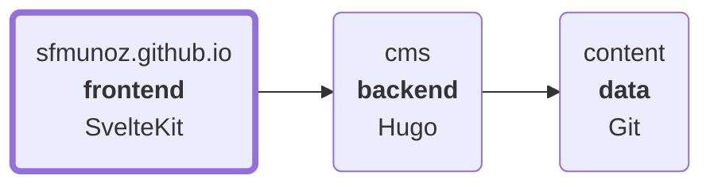

# sfmunoz.com

[https://sfmunoz.com](https://sfmunoz.com) repository

- [Architecture](#architecture)

## Architecture

```mermaid
flowchart LR
    sfmunoz("`sfmunoz.github.io<br>**frontend**<br>SvelteKit`")
    style sfmunoz stroke-width:4px
    cms("`cms<br>**backend**<br>Hugo`")
    content("`content<br>**data**<br>Git`")
    sfmunoz --> cms --> content
```
